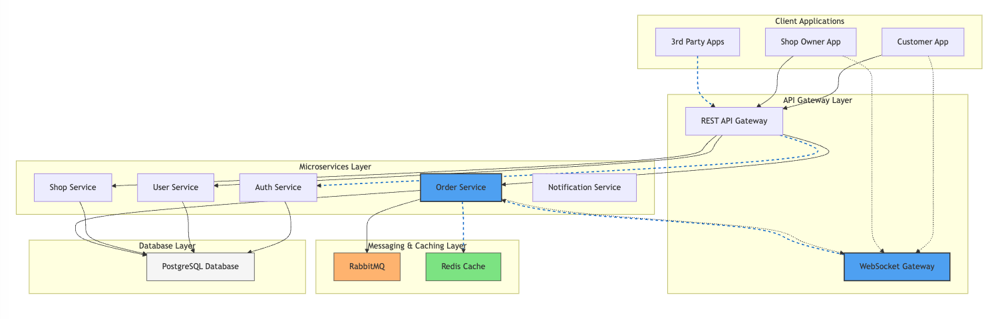
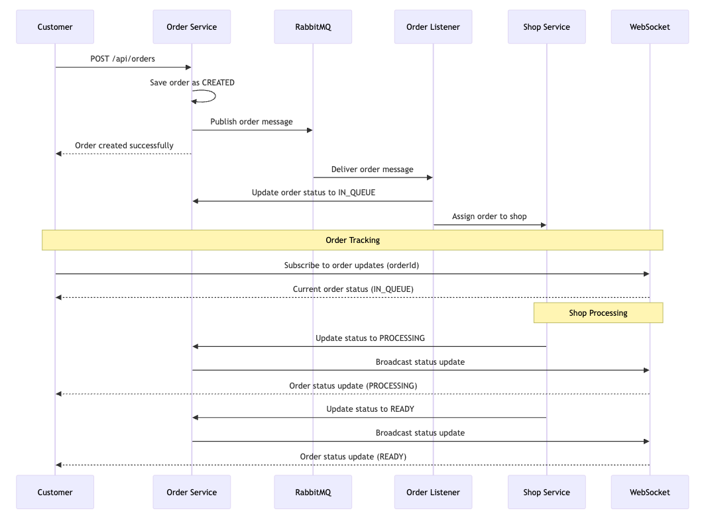
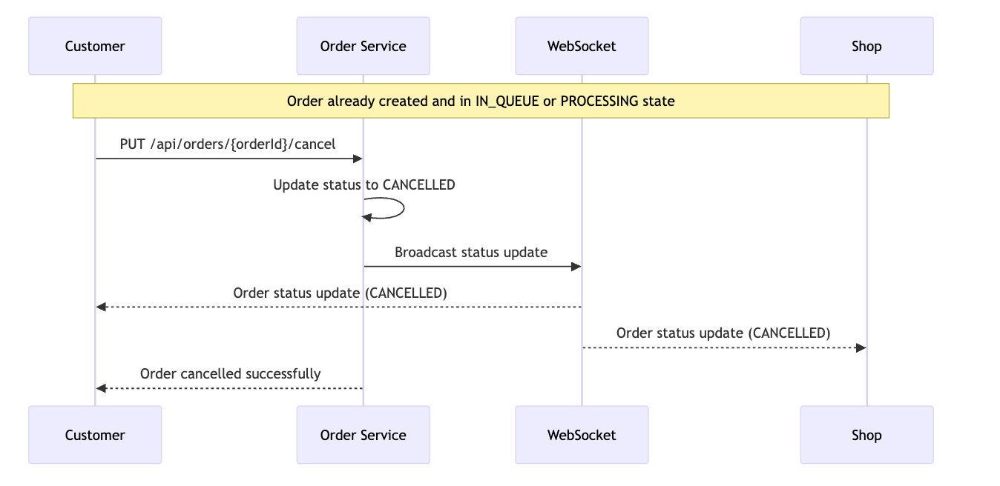
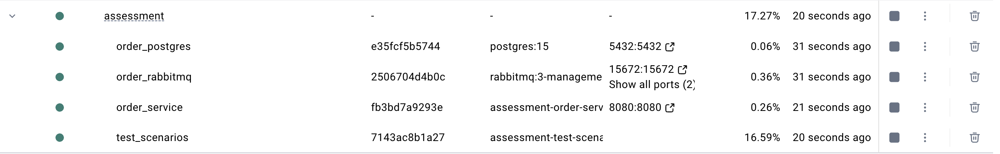

# Coffee Shop Order Management System

## Solution Design

### Architecture Overview
The system follows a microservices architecture with the following key components:



1. **API Gateway Layer**
   - REST API Gateway for HTTP requests
   - WebSocket Gateway for real-time updates

2. **Core Microservices**
   - Auth Service: Authentication and authorization
   - User Service: User profile management
   - Shop Service: Shop management and menu configuration
   - Order Service: Order processing and tracking
   - Notification Service: Handle notifications

3. **Infrastructure Components**
   - RabbitMQ: Message broker for async communication
   - Redis Cache: Real-time data and session management
   - PostgreSQL: Persistent data storage

### Project structures
- Diagrams folder: Contains the architecture diagrams
- Order-Service: Contains the Order Service implementation
- Test-Scenarios: Contains the Cucumber test scenarios

### Key Flows (Implemented in Order Service)

1. **Order Processing Flow**

(Note: Shop Service here is a placeholder for the actual service that processes the order)



   Step-by-step breakdown of the order processing flow:
   1. Customer sends a POST request to /api/orders endpoint of the Order Service
   2. Order Service saves the order with status "CREATED"
   3. Order Service publishes an order message to RabbitMQ
   4. Order Service returns order details to the Customer with "Order created successfully"
   5. RabbitMQ delivers the order message to the Order Listener
   6. Order Listener updates the order status to "IN_QUEUE" via the Order Service
   7. Order Listener assigns the order to a Shop Service
   8. Customer subscribes to order updates via WebSocket (providing orderId)
   9. WebSocket sends the current order status ("IN_QUEUE") to the Customer
   10. Shop Service updates the order status to "PROCESSING" via the Order Service
   11. Order Service broadcasts the status update to WebSocket
   12. WebSocket sends the order status update ("PROCESSING") to the Customer
   13. Shop Service updates the order status to "READY" via the Order Service
   14. Order Service broadcasts the status update to WebSocket
   15. WebSocket sends the order status update ("READY") to the Customer


2. **Order Cancellation Flow**

(Note: Shop Service here is a placeholder for the actual service that processes the order)


   Step-by-step breakdown of the order cancellation flow:
   1. Customer sends a PUT request to /api/orders/{orderId}/cancel endpoint of the Order Service
   2. Order Service updates the order status to "CANCELLED"
   3. Order Service broadcasts the status update to WebSocket
   4. WebSocket sends the order status update ("CANCELLED") to the Customer
   5. WebSocket sends the order status update ("CANCELLED") to the Shop
   6. Order Service returns confirmation to the Customer with "Order cancelled successfully"

## Technology Stack & Purpose

### Implemented:
- **Java Spring Boot (v17), Spring Boot 3.4.3, Cucumber**
- **PostgreSQL**
- **RabbitMQ**
- **Docker & Docker Compose**

## Security Solution (Not Implemented)
### JWT Token Authentication
1. **Token Structure**
   - Header: Algorithm & token type
   - Payload: User claims (id, roles, permissions)
   - Signature: Encrypted verification

2. **Token Flow**
   - User logs in → Receives JWT token
   - Token included in Authorization header
   - Gateway validates token for each request

### Role-Based Access Control (RBAC)
1. **User Roles**
   - CUSTOMER: Basic order operations
   - SHOP_OWNER: Shop management & order processing
   - ADMIN: System configuration

2. **Permission Levels**
   - READ: View resources
   - WRITE: Create/modify resources
   - ADMIN: Full access to resources

## API Endpoints

### REST APIs
#### Order Management
- POST /api/orders
- GET /api/orders/{orderId}
- PUT /api/orders/{orderId}/cancel
- GET /api/orders/queue-status

### WebSocket Endpoints
#### Order Updates
- ws://host/ws/order/{orderId}
  - Receive real-time order status updates
  - Queue position updates
  - Estimated waiting time updates

## Testing Strategy

### BDD Testing with Cucumber
We use Behavior-Driven Development (BDD) with Cucumber for testing our application. The test scenarios are written in Gherkin syntax, making them readable by both technical and non-technical stakeholders.

## Key Test Features

1. **Order Queue Management** (`order_queue_management.feature`)
File: [order_queue_management.feature](test-scenarios/src/test/resources/features/order_queue_management.feature)
   - Tests queue creation and order tracking
   - Validates queue position and waiting time
   - Ensures proper queue size management

2. **Order Processing and Real-time Tracking** (`order_processing_and_tracking.feature`)
File: [order_processing_and_tracking.feature](test-scenarios/src/test/resources/features/order_processing_and_tracking.feature)
   - Tests end-to-end order processing
   - Validates WebSocket notifications
   - Ensures proper status transitions

## Test Scenarios Coverage

1. **Queue Management Tests**
File: [order_queue_management.feature](test-scenarios/src/test/resources/features/order_queue_management.feature)
   - ORDER-001: Single order queue creation and tracking
   - ORDER-002: Multiple orders queue management
   - ORDER-003: Order status update notifications

2. **Order Processing Tests**
File: [order_processing_and_tracking.feature](test-scenarios/src/test/resources/features/order_processing_and_tracking.feature)
   - ORDER-004: Complete order processing flow with WebSocket updates
   - ORDER-005: Order cancellation with real-time notifications

### Testing Application

1. **Local with Docker Compose**
- Run the following command to start the application with Docker Compose:
```bash
docker compose -f docker-compose-app.yml up --build -d
```
or (docker compose or docker-compose)
```bash
docker-compose -f docker-compose-app.yml up --build -d
```
It will start all required services (PostgreSQL, RabbitMQ),

And Start the application running on 8080 port.

And Run the Cucumber tests.

And copy the report to the host machine under current folder as `cucumber-report.html`.


Sample test results:
[cucumber-reports.html](cucumber-reports.html)
