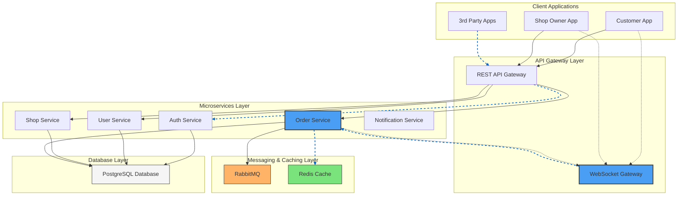

## Architecture Overview with WebSocket for Order Tracking

This diagram represents a microservices architecture for a food ordering system with real-time order tracking capabilities via WebSockets.

### Key Components:

1. **Client Applications**
   - Customer App: Used by customers to place and track orders in real-time
   - Shop Owner App: Used by restaurant/shop owners to manage orders and inventory
   - 3rd Party Apps: External applications that integrate with the system

2. **API Gateway Layer**
   - REST API Gateway: Handles traditional HTTP requests
   - WebSocket Gateway: Manages persistent WebSocket connections for real-time updates

3. **Microservices Layer**
   - Auth Service: Handles authentication and authorization
   - User Service: Manages user profiles and preferences
   - Shop Service: Manages shop/restaurant information
   - Order Service: Processes and tracks orders (highlighted as a key service)

4. **Messaging & Caching Layer**
   - RabbitMQ: Message broker for asynchronous communication between services
   - Redis Cache: In-memory data store for caching and pub/sub capabilities

5. **Database Layer**
   - PostgreSQL: Persistent storage for all services

### WebSocket Flow for Order Tracking:

1. When an order status changes, the Order Service directly updates connected clients
2. The Order Service communicates with the WebSocket Gateway to push updates
3. The WebSocket Gateway pushes real-time updates to connected clients (Customer App and Shop Owner App)
4. The Order Service can use Redis for temporary state storage and RabbitMQ for processing order events

### Visual Representation:
- **Solid lines**: Regular HTTP/API communication
- **Dashed lines**: WebSocket/real-time communication
- **Blue highlighted components**: Key services in the WebSocket flow
- **Orange component**: Message broker (RabbitMQ)
- **Green component**: Caching layer (Redis)

This architecture enables real-time order tracking, allowing customers to see live updates of their order status and shop owners to receive instant notifications about new orders. By having the Order Service directly handle WebSocket communications, the architecture is simplified while maintaining the ability to provide real-time updates. 