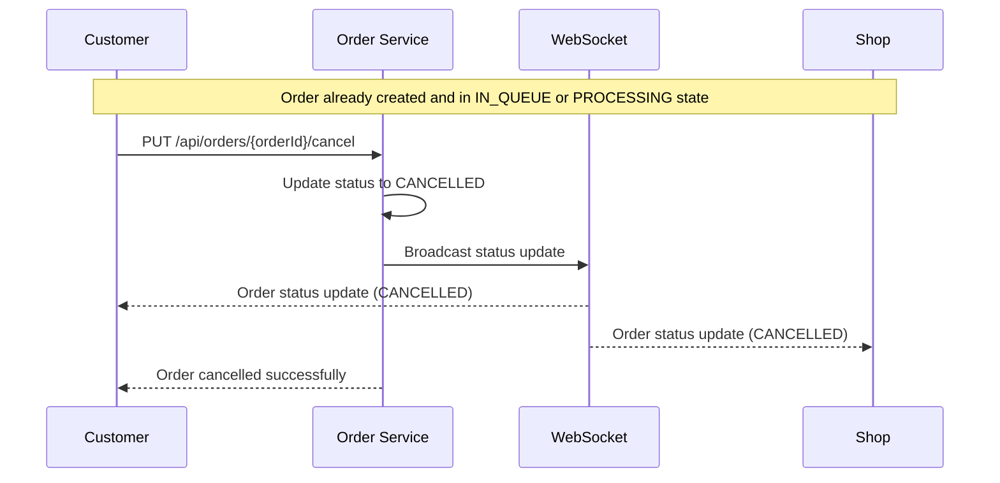

Step-by-step breakdown of the order cancellation flow:
1. Customer sends a PUT request to /api/orders/{orderId}/cancel endpoint of the Order Service
2. Order Service updates the order status to "CANCELLED"
3. Order Service broadcasts the status update to WebSocket
4. WebSocket sends the order status update ("CANCELLED") to the Customer
5. WebSocket sends the order status update ("CANCELLED") to the Shop
6. Order Service returns confirmation to the Customer with "Order cancelled successfully" 