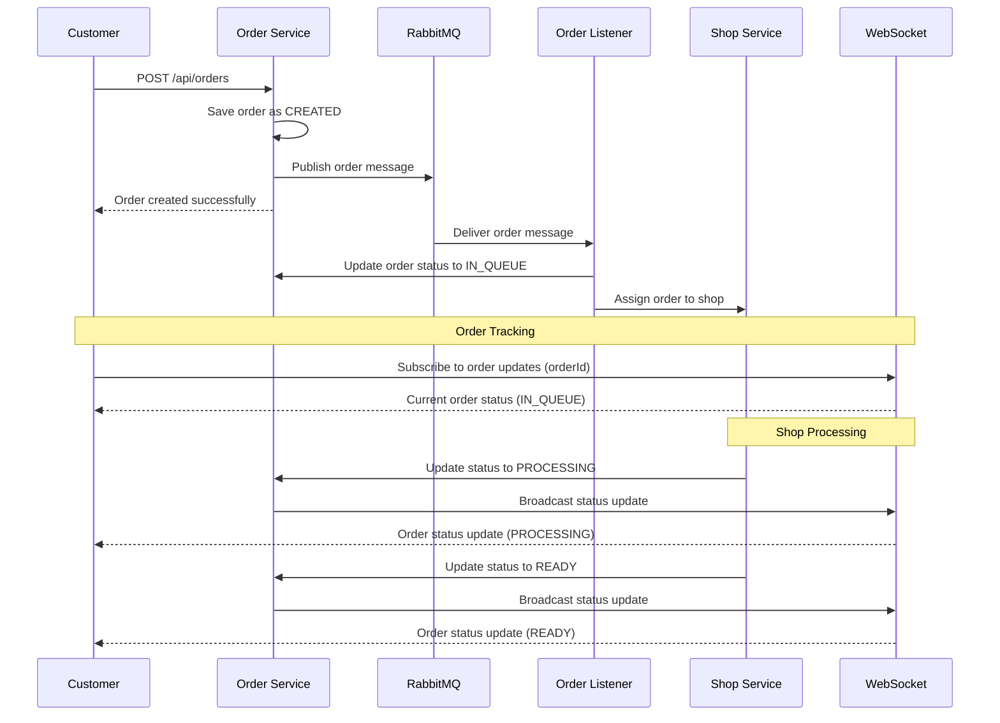

Step-by-step breakdown of the order processing flow:
1. Customer sends a POST request to /api/orders endpoint of the Order Service
2. Order Service saves the order with status "CREATED"
3. Order Service publishes an order message to RabbitMQ
4. Order Service returns order details to the Customer with "Order created successfully"
5. RabbitMQ delivers the order message to the Order Listener
6. Order Listener updates the order status to "IN_QUEUE" via the Order Service
7. Order Listener assigns the order to a Shop Service
8. Customer subscribes to order updates via WebSocket (providing orderId)
9. WebSocket sends the current order status ("IN_QUEUE") to the Customer
10. Shop Service updates the order status to "PROCESSING" via the Order Service
11. Order Service broadcasts the status update to WebSocket
12. WebSocket sends the order status update ("PROCESSING") to the Customer
13. Shop Service updates the order status to "READY" via the Order Service
14. Order Service broadcasts the status update to WebSocket
15. WebSocket sends the order status update ("READY") to the Customer